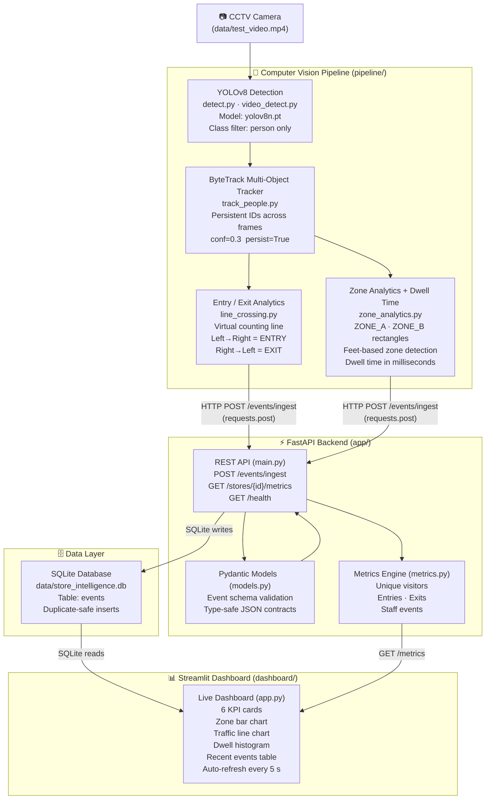

# Store Intelligence System — Architecture

> **Hackathon Project** · End-to-end AI-powered retail analytics system that turns raw CCTV footage into live business intelligence.

---

## System Architecture Diagram



---

## Component Deep Dive

### 1. 📷 CCTV Camera Feed
| Property | Value |
|---|---|
| **File** | `data/test_video.mp4` |
| **Format** | Any OpenCV-compatible video (MP4, AVI, RTSP) |
| **Role** | Source of raw visual frames fed into the CV pipeline |

In production this would be a live RTSP stream from an IP camera. For this hackathon demo we replay a pre-recorded video so results are fully reproducible and the system runs without network hardware.

---

### 2. 🤖 YOLOv8 Detection (`pipeline/detect.py`, `video_detect.py`)
| Property | Value |
|---|---|
| **Model** | `yolov8n.pt` (Nano — fastest inference) |
| **Library** | `ultralytics` |
| **Class filter** | `classes=[0]` — persons only |
| **Outputs** | Bounding boxes with `[x_center, y_center, w, h]` and confidence scores |

YOLOv8 is a single-pass convolutional neural network that runs on every video frame. It is intentionally limited to detecting only humans (`class 0`) to reduce false positives from shopping carts, bags, or mannequins.

---

### 3. 🔗 ByteTrack Multi-Object Tracker (`pipeline/track_people.py`)
| Property | Value |
|---|---|
| **Tracker** | `bytetrack.yaml` |
| **Persistence** | `persist=True` — memory held across frames |
| **Confidence** | `conf=0.3` — low threshold keeps partly-occluded people tracked |
| **Outputs** | Stable `Track IDs` → `VIS_<id>` visitor identifiers |

ByteTrack's key innovation is using *both* high-confidence and low-confidence detections for association. When a shopper ducks behind a shelf, their low-confidence detection still matches them to their existing Track ID, preventing an ID switch that would inflate the unique visitor count.

---

### 4. 🚪 Entry / Exit Analytics (`pipeline/line_crossing.py`)
| Property | Value |
|---|---|
| **Method** | Virtual counting line at `x = frame_width // 2` |
| **ENTRY rule** | `prev_x < line_x` and `curr_x >= line_x` |
| **EXIT rule** | `prev_x > line_x` and `curr_x <= line_x` |
| **Duplicate guard** | `counted_ids = set()` — one event per crossing per visitor |

This mirrors the real-world technique used in commercial people-counters (e.g., Xovis, RetailNext). The virtual line concept generalises to any doorway, staircase, or aisle threshold — just change `line_x`.

---

### 5. 📍 Zone Analytics + Dwell Time (`pipeline/zone_analytics.py`)
| Property | Value |
|---|---|
| **Zones** | `ZONE_A` (Cosmetics) · `ZONE_B` (Skincare) |
| **Detection** | `is_inside_zone(x_feet, y_feet, coords)` — feet-based for accuracy |
| **Dwell time** | `current_time_ms − enter_time_ms` → milliseconds |
| **Events** | `ZONE_ENTER` and `ZONE_EXIT` with `dwell_ms` populated on exit |

Using the **bottom center** of the bounding box (the person's feet) for zone detection is a significant accuracy improvement over using the centroid. If a shopper leans over a shelf into the next zone, their feet still reliably indicate where they are physically standing.

---

### 6. ⚡ FastAPI Backend (`app/main.py`, `app/models.py`, `app/metrics.py`)
| Endpoint | Method | Purpose |
|---|---|---|
| `/` | GET | Health check / version |
| `/health` | GET | Liveness probe |
| `/events/ingest` | POST | Bulk-ingest `List[Event]` into SQLite |
| `/stores/{store_id}/metrics` | GET | Aggregate KPIs per store |

The `Event` Pydantic model enforces strict schema validation — if the CV pipeline sends a malformed payload (wrong type, missing field), FastAPI rejects it with a `422 Unprocessable Entity` before it ever touches the database.

---

### 7. 🗄️ SQLite Database (`data/store_intelligence.db`)
| Column | Type | Notes |
|---|---|---|
| `event_id` | TEXT PRIMARY KEY | UUID — prevents duplicate inserts |
| `store_id` | TEXT | Multi-store support |
| `camera_id` | TEXT | Multi-camera support |
| `visitor_id` | TEXT | `VIS_<track_id>` format |
| `event_type` | TEXT | ENTRY · EXIT · ZONE_ENTER · ZONE_EXIT |
| `timestamp` | TEXT | ISO 8601 UTC |
| `zone_id` | TEXT | ZONE_A · ZONE_B · null |
| `dwell_ms` | INTEGER | 0 for ENTRY/EXIT events |
| `is_staff` | INTEGER | Boolean (0/1) |
| `confidence` | REAL | Model confidence score |

SQLite is chosen for hackathon simplicity. The schema is designed to be swapped to PostgreSQL with zero application code changes — just update the connection string in `app/database.py`.

---

### 8. 📊 Streamlit Dashboard (`dashboard/app.py`)

| Widget | Description |
|---|---|
| **6 KPI Cards** | Unique Visitors, Entries, Exits, Zone A, Zone B, Avg Dwell |
| **Zone Bar Chart** | Top zones ranked by visit frequency |
| **Traffic Line Chart** | Hourly ENTRY / EXIT volume over time |
| **Dwell Histogram** | Distribution of visitor dwell times by zone |
| **Events Table** | Latest 20 raw events with timestamp, visitor, type, zone |
| **Auto-refresh** | `st.rerun()` every 5 seconds — no page reload needed |

---

## Data Flow Summary

```
Raw video frame
    ↓ YOLOv8 (bounding boxes)
    ↓ ByteTrack (stable Track IDs)
    ↓ Line Crossing / Zone Logic (business events)
    ↓ HTTP POST → FastAPI (schema validation)
    ↓ SQLite (durable storage)
    ↓ Streamlit (live analytics)
```

---

## Technology Stack

| Layer | Technology | Reason |
|---|---|---|
| Computer Vision | YOLOv8 Nano + ByteTrack | State-of-the-art accuracy at real-time speed |
| Video I/O | OpenCV | Industry standard for frame-level processing |
| Backend | FastAPI + Uvicorn | Async, type-safe, auto-generated API docs |
| Validation | Pydantic v2 | Zero-cost schema enforcement |
| Storage | SQLite | Zero-config, file-based, swap-ready for Postgres |
| Dashboard | Streamlit + Plotly | Fastest path from data to interactive charts |
| Language | Python 3.13 | Unified stack — no context switching |

---

## Running the System

Open **three terminal windows** in the project root:

```bash
# Terminal 1 — FastAPI backend
uvicorn app.main:app --reload

# Terminal 2 — AI pipeline (choose one)
python pipeline/zone_analytics.py      # Zone + dwell analytics
python pipeline/line_crossing.py       # Entry/exit counting only

# Terminal 3 — Live dashboard
streamlit run dashboard/app.py
```

Open **http://localhost:8501** in your browser to see the live dashboard.
